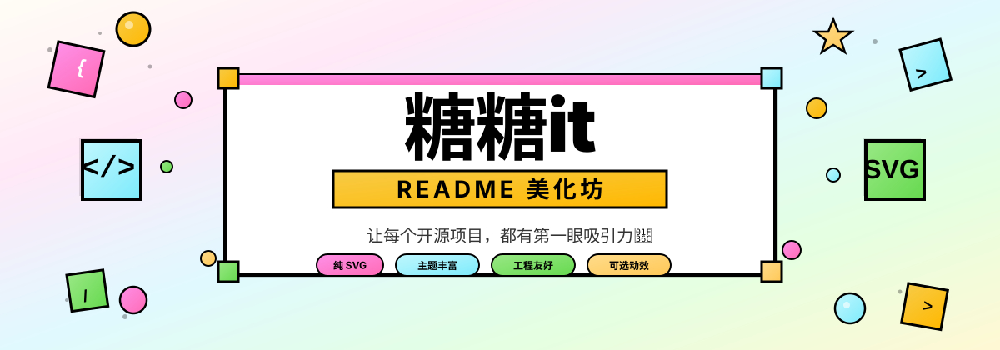
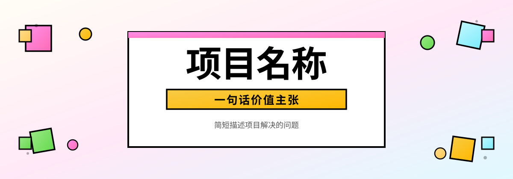
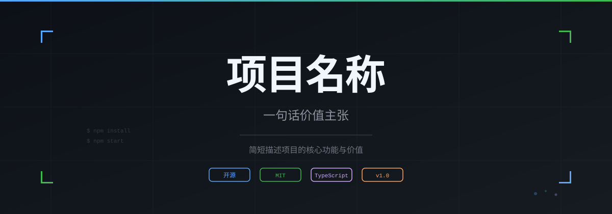
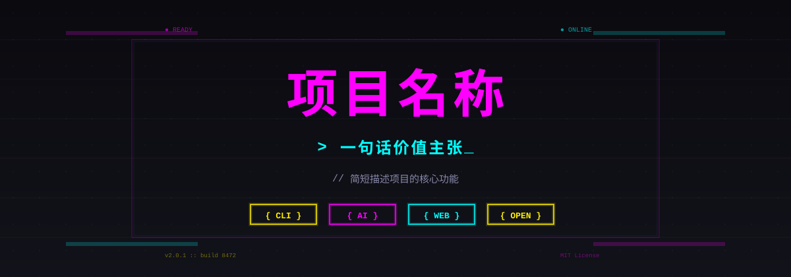
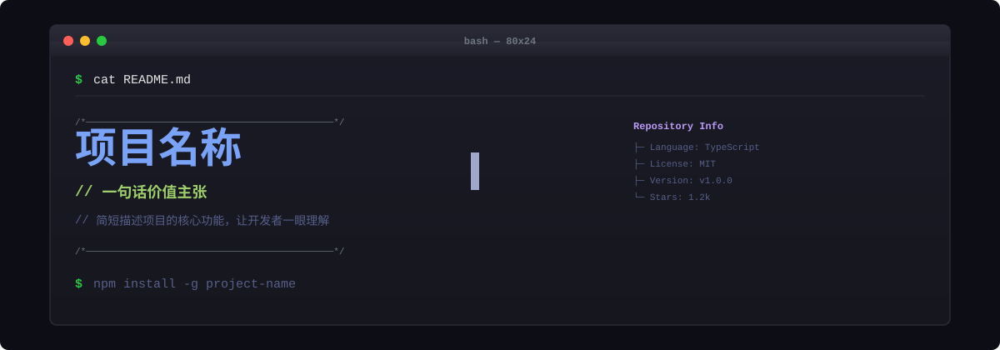
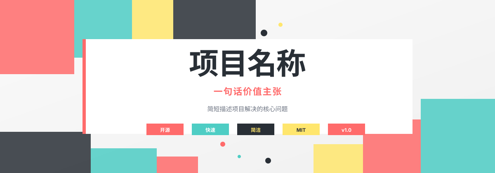

<p align="center">
  
</p>

<p align="center">
  <a href="#-关于糖糖it">关于</a> ·
  <a href="#-banner-样式集合">Banner 样式</a> ·
  <a href="#-快速开始">快速开始</a> ·
  <a href="#-工具脚本">工具脚本</a>
</p>

---

## 🍬 关于糖糖it

嗨，我是**糖糖it**！一位热爱设计的独立开发者和 UI 设计师。我相信一个好的开源项目值得一个第一眼就能让人理解的首页。这个 Skill 是我为所有开源创作者准备的礼物——用专业的视觉设计，让你的项目在 GitHub 上脱颖而出。

我的设计理念很简单：
- **不套模板** — 每个项目的视觉都应该来自项目本身
- **工程友好** — 产出物在 GitHub 上可靠渲染，易于维护
- **可选动效** — 纯 SVG 默认，动画 GIF 需要你主动选择

---

## 🎨 Banner 样式集合

Skill 内置 **7 套精选 Banner 样式模板**，智能体可直接选择并生成定制 SVG。以下为各样式预览：

<p align="center">
  <strong>1. 糖果新野兽派</strong> — 粗黑边框、糖果配色、白色大卡片 ☀️
  <br>
  
</p>

<p align="center">
  <strong>2. 极简暗色</strong> — 深色 GitHub 风、网格背景、蓝绿强调 🌙
  <br>
  
</p>

<p align="center">
  <strong>3. 赛博朋克霓虹</strong> — 深黑网格、品红/青霓虹发光、等宽字体 🌙
  <br>
  
</p>

<p align="center">
  <strong>4. 清新薄荷</strong> — 薄荷绿柔底、24px圆角、软阴影、治愈风 ☀️
  <br>
  
</p>

<p align="center">
  <strong>5. 渐变现代</strong> — 紫粉渐变、玻璃拟态、光晕装饰 🌑
  <br>
  
</p>

<p align="center">
  <strong>6. 代码终端风</strong> — 终端窗口模拟、命令行界面 🌙
  <br>
  
</p>

<p align="center">
  <strong>7. 几何抽象</strong> — 大胆几何色块、高对比度、极简主义 ☀️
  <br>
  
</p>

> 模板位于 `assets/readme/banners/`，智能体读取模板后按项目信息定制输出。

---

## 🚀 快速开始

### 在智能体中使用

在智能体中直接描述你的需求即可：

```
使用 $tangtang-readme 的极简暗色样式为我的项目生成一个 Banner
```

```
使用 $tangtang-readme 为我的 CLI 工具创建 Banner，用代码终端风样式
```

```
使用 $tangtang-readme 查看所有 Banner 样式，帮我为项目选一个合适的
```

### 工作模式

Skill 支持两种模式：

1. **README 全模式** — 整体改造 README 的信息架构、文案和视觉系统
2. **仅资产模式** — 只创建视觉资产（Hero、章节头、流程图、徽章），不改动 README

### 视觉实现

对于 Hero 等大型视觉资产，你可以选择：

- **纯 SVG** — 完全矢量，轻量锐利，最适合排版、图表、图标
- **混合 SVG 合成** — SVG 排版 + AI 生成主体图像，适合角色和复杂材质

动画 GIF 是 opt-in 选项，默认不生成。

---

## 💡 仓库配套最佳实践（关于栏与 SEO 外链）

高颜值的 README 只是第一步，完善 GitHub 仓库的关于栏（About）配置能为项目带来极高的搜索引擎权重和流量闭环：

- **GitHub 仓库关于栏挂链（权重极高）**：
  - 进入你的 GitHub 仓库（例如 `tangtang-it/mdpreview`）；
  - 点击右侧齿轮（**About Settings**），在 **Website** 填入 `https://mdpreview.dev/`；
  - 在 **Topics** 添加标签：`markdown`, `markdown-viewer`, `developer-tools`, `gfm`。

## 📁 项目结构

```
tangtang-readme/
├── assets/readme/
│   ├── hero.svg                    # 项目自身 Hero Banner
│   └── banners/                    # ✨ 7套 Banner 样式模板
│       ├── candy-brutalist.svg     # 糖果新野兽派
│       ├── minimal-dark.svg        # 极简暗色
│       ├── cyberpunk-neon.svg      # 赛博朋克霓虹
│       ├── fresh-mint.svg          # 清新薄荷
│       ├── gradient-modern.svg     # 渐变现代
│       ├── code-terminal.svg       # 代码终端风
│       └── geometric-abstract.svg  # 几何抽象
├── skills/tangtang-readme/
│   ├── SKILL.md                    # 核心 Skill 定义
│   ├── agents/openai.yaml          # Agent 配置
│   ├── references/                 # 设计指南
│   │   ├── content-architecture.md # 内容架构指南
│   │   ├── github-readme-canvas.md # GitHub 画布规范
│   │   ├── hybrid-svg-production.md # 混合合成指南
│   │   ├── motion-production.md    # 动画制作指南
│   │   ├── project-native-hero.md  # 项目原生 Hero 设计
│   │   ├── showcase-contribution.md # 展示贡献指南
│   │   ├── svg-production.md       # SVG 制作规范
│   │   └── theme-direction.md      # 主题选择与方向
│   └── scripts/
│       ├── audit_readme.py         # README 审计工具
│       └── render_motion_gif.py    # GIF 渲染工具
├── .gitignore
├── LICENSE
└── README.md
```

---

## 🛠️ 工具脚本

### 审计 README
```bash
python3 skills/tangtang-readme/scripts/audit_readme.py /path/to/README.md
```
检查图片引用完整性、SVG 兼容性（viewBox、title、不安全标签）。

### 渲染动画 GIF
```bash
python3 skills/tangtang-readme/scripts/render_motion_gif.py input.svg output.gif --spec motion.json
```
将带命名图层的 SVG 和 JSON 动效规格渲染为 GitHub 安全的动画 GIF。

依赖：Pillow (`pip install Pillow`)，以及 resvg / rsvg-convert / Inkscape / cairosvg 之一用于 SVG 渲染。

---

## ✨ 质量承诺

糖糖it对每个产出都有严格的质量标准：

- ✅ 首屏无需先验知识即可理解项目
- ✅ 设计看起来是项目原生的，不是模板
- ✅ Hero 素材来自项目本身，不是通用装饰
- ✅ 真实证明出现在抽象声明之前
- ✅ 图片失败时内容仍然有效（alt 文本、命令、链接）
- ✅ README 变得更短或更清晰，不只是更花哨
- ✅ GitHub 明暗模式下都可读
- ✅ 移动端 360px 宽度下关键内容可读

---

## 📝 许可证

MIT License - 详见 [LICENSE](LICENSE) 文件。

你可以自由使用这个 Skill 美化任何项目（包括商业项目）。署名「糖糖it出品」完全可选，不是使用的必要条件。

---

<p align="center">
  Made with 🍬 by <strong>糖糖it</strong>
</p>